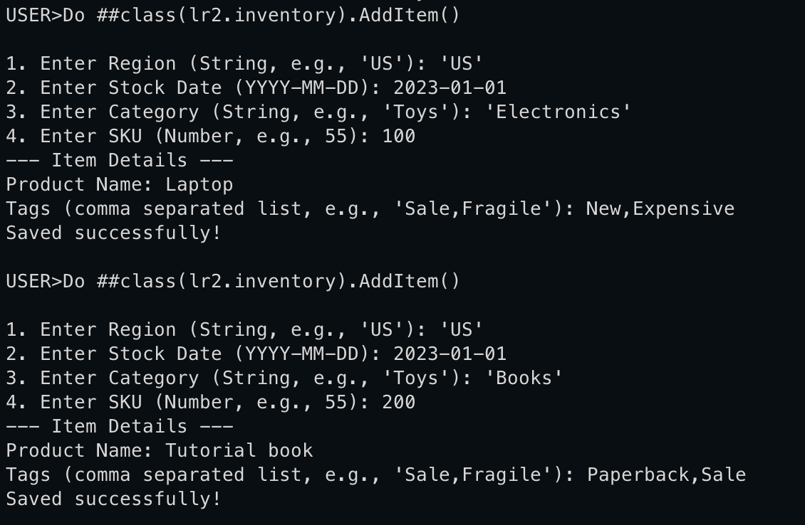
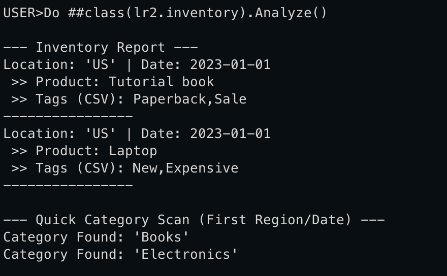

# Practice 2 (globals)

Create a global that has 4 subscripts of 3 different types (numbers, dates, strings, lists etc).
Use as a value for nodes both types of lists.
Show usage of at least 4 built-in functions to work with arrays.
All parameters should be read from input device. Global and functions should make sense.

## Demonstration:

Creating new items:

Analyze:

