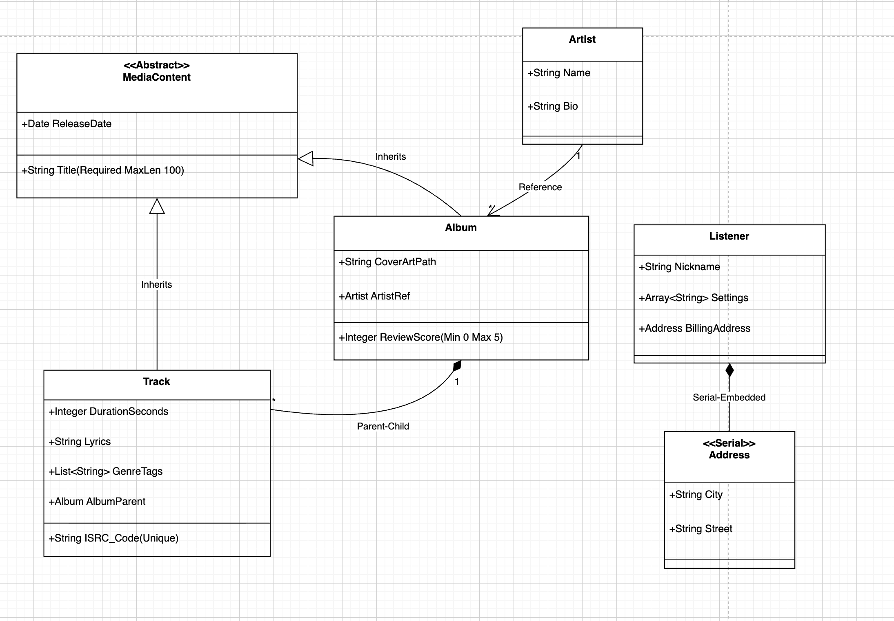

<!--  -->

# Practice 3

Choose a subject area and think of several classes that are connected to each other via different types of properties. Draw a class diagram that has:

- Inheritance from abstract class
- Single literal properties
- Reference from one class to another (or the same class)
- Built-in object
- Collection-list and collection-array of simple types or objects
- Character or binary stream
- One-many and parent-children relationships between two classes
  Make one of the properties required.
  Make another (or the same) property unique.
  Set constraints on the value of one property (minval and maxval for numbers, minlen and maxlen for strings).
  Classes and properties should make sense.

# Music Streaming Service Design

So, for my subject area, I chose a music streaming backend. Here is how I structured the classes and why I connected them this way:

## 1. The Base Layer (Abstract Class)

I started by creating an abstract class called MediaContent.
Since both Albums and Tracks share things like a "Title" and a "Release Date," I put those properties here.
This way, Album and Track just inherit them, and I don’t have to repeat the code.

## 2. Organizing the Music (Parent-Child)

I connected Album and Track using a Parent-Child relationship.
This is important because a track essentially belongs to an album.
If I ever delete an album from the database, I want all the tracks inside it to disappear automatically (cascading delete)
so I don't end up with "orphan" songs floating around.

## 3. Linking the Artist (Reference)

For the Artist, I used a simple Reference link to the Album.
This is different from the tracks because an Artist is an independent entity.
If I delete an album, I definitely don't want to delete the Artist from the system. They just point to each other.

## 4. Performance Optimization (Serial Objects)

For the user's Address, I didn't want to make a whole separate table.
I defined it as a Serial object so it gets embedded directly inside the Listener data.
It’s faster to read since it’s all in one place.

## 5. Safety Rules (Constraints)

Finally, I added some constraints to keep the data clean.
I made the ISRC_Code unique so we never have duplicate songs,
and I limited the ReviewScore to be between 0 and 5 so nobody can break the rating system.
