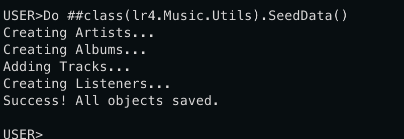
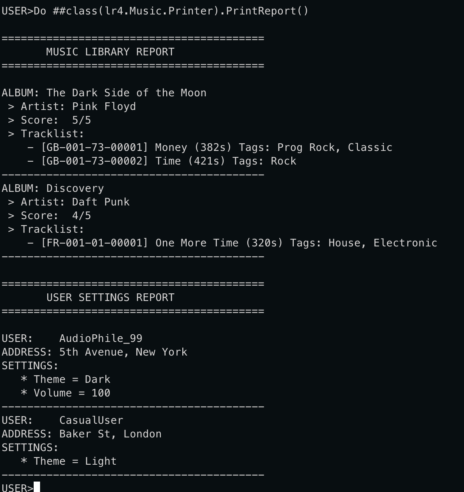

# Practice 4 (objects)

Create classes in a DB from a Class Diagram from Practice 3.
Create at least 2 objects of each class, set all their properties minding all the constraints (unique, required etc) and save all the objects to the DB.
Objects and their properties should make sense.

# Music Streaming Service

Create objects script execution:

Printer script execution:

