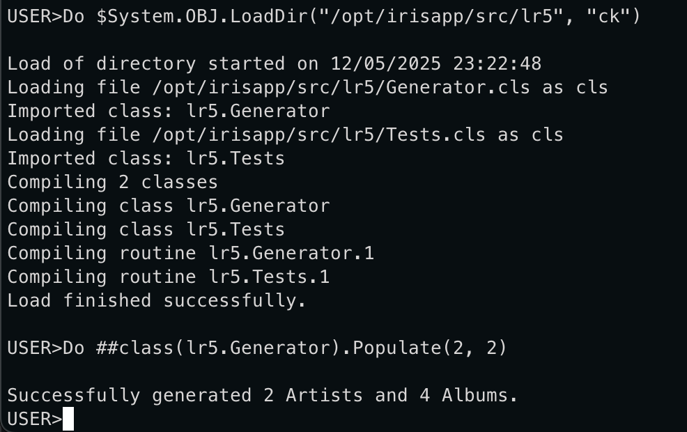
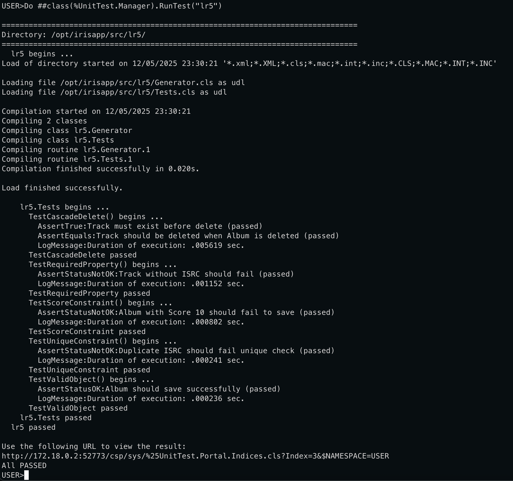

# Practice №5 (methods)

Add an always computed property to one of the classes and write a getter for it.
Create code for automatic data generation for all classes.
Create code for Unit Testing a class/classes where there are unique, required, constrained properties and relationship and check that all tests succeed:

- Test creation of the object
- Test unique, required, constrained properties
- Test behavior when deleting an object with many/children relationship
- Test deletion of the object

# Generating and testing

Here's generation script execution:

After generation we need to test all 5 cases mentioned in a task description:

